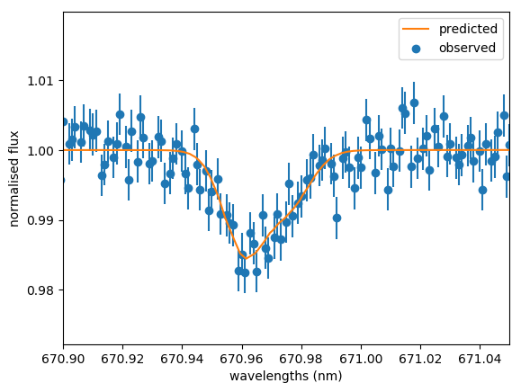

Example 2: Check predicted abundance
====================================

About
-----

This example will show you how to predict a spectrum from a given abundance using the ``Interpolate`` class in ``breidablik.interpolate.spectra``.

Example
-------

We have an output lithium abundance prediction, but it is good to check what the profile for this predicted abundance looks like, and if it matches the observed spectra.

We'll use the same models to predict what the spectra looks like. The stellar parameters will be the same, and the abundance will be the predicted abundance. These variables in the following code are the same as those in example 1: predict abundance from spectra.

::

  # predict flux
  pred_flux = models.predict_flux(t_eff, log_g, met, abund)
  # read in wavelengths for predicted flux
  from breidablik.analysis import read
  pred_wl = read.get_wavelengths()
  # all of the simulated spectra have the same wavelength points

We can plot the observed flux and the predicted flux to see if they look similar.

::

  # plot observed and predicted flux
  import matplotlib.pyplot as plt
  plt.scatter(wl, flux, label = 'observed', color = 'C0')
  plt.errorbar(wl, flux, yerr = flux_err, ecolor = 'C0', fmt = 'none')
  plt.plot(pred_wl, pred_flux, label = 'predicted', color = 'C1')
  plt.legend()
  plt.xlim(670.9, 671.05)
  plt.show()

You should have something that looks like this:

.. _obs_pred:

   Observed spectrum and the corresponding predicted spectrum interpolated using the abundance predicted from the observed spectrum.
